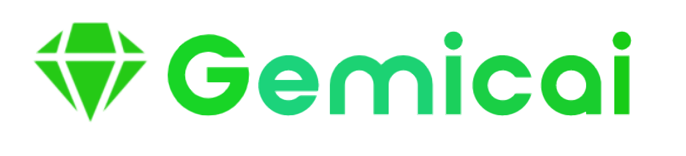
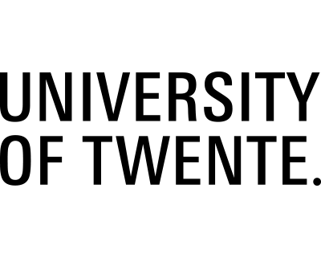
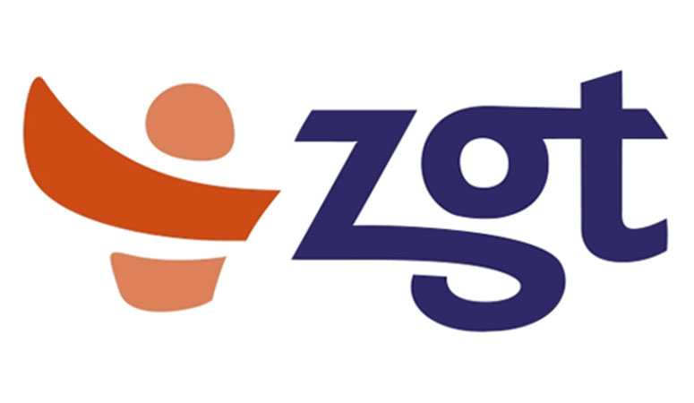

     

# Introduction
Gemic is at its core a deep learning library that makes working with TensorFlow easier. Gemic also contains extensive functionality for the Dicom standard. This makes Gemic an excellent tool for dealing with deep-learning-based medical image classifiers. bla bla bla more introduction (The logo is just a placeholder for now and generated at https://app.brandmark.io/v3/)

# Documentation
Go to https://docs.gemic.ai for the documentation. Lorem ipsum dolor sit amet, consectetur adipiscing elit, sed do eiusmod tempor incididunt ut labore et dolore magna aliqua. Ut enim ad minim veniam, quis nostrud exercitation ullamco laboris nisi ut aliquip ex ea commodo consequat. Duis aute irure dolor in reprehenderit in voluptate velit esse cillum dolore eu fugiat nulla pariatur. Excepteur sint occaecat cupidatat non proident, sunt in culpa qui officia deserunt mollit anim id est laborum.

# Installation
The distribution is hosted on pypi at: https://pypi.python.org/pypi/gemicai/. You can install the package with pip by running the following command in your terminal:

    $ pip install gemicai
    
Lorem ipsum dolor sit amet, consectetur adipiscing elit, sed do eiusmod tempor incididunt ut labore et dolore magna aliqua. Ut enim ad minim veniam, quis nostrud exercitation ullamco laboris nisi ut aliquip ex ea commodo consequat. Duis aute irure dolor in reprehenderit in voluptate velit esse cillum dolore eu fugiat nulla pariatur. Excepteur sint occaecat cupidatat non proident, sunt in culpa qui officia deserunt mollit anim id est laborum.

# Jupyter Notebook Intro to Gemicai
Go to https://learn.gemic.ai/ or put the Jupter Notebook files somewhere in the repo. Our make another .md file to link to? Lorem ipsum dolor sit amet, consectetur adipiscing elit, sed do eiusmod tempor incididunt ut labore et dolore magna aliqua. Ut enim ad minim veniam, quis nostrud exercitation ullamco laboris nisi ut aliquip ex ea commodo consequat. Duis aute irure dolor in reprehenderit in voluptate velit esse cillum dolore eu fugiat nulla pariatur. Excepteur sint occaecat cupidatat non proident, sunt in culpa qui officia deserunt mollit anim id est laborum.

# Development
Development made possible by a collaboration of ZGT (_"Ziekenhuisgroep Twente"_, translated from Dutch "Hospital Group Twente") and University of Twente. Lorem ipsum dolor sit amet, consectetur adipiscing elit, sed do eiusmod tempor incididunt ut labore et dolore magna aliqua. Ut enim ad minim veniam, quis nostrud exercitation ullamco laboris nisi ut aliquip ex ea commodo consequat. Duis aute irure dolor in reprehenderit in voluptate velit esse cillum dolore eu fugiat nulla pariatur. Excepteur sint occaecat cupidatat non proident, sunt in culpa qui officia deserunt mollit anim id est laborum.

 

### Special thanks
Jeroen Geerdink, Other people, bla bla Lorem ipsum dolor sit amet, consectetur adipiscing elit, sed do eiusmod tempor incididunt ut labore et dolore magna aliqua.

**Copyright (c) 2020 Ziekhuisgroep Twente**
