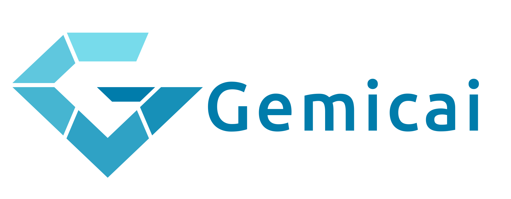
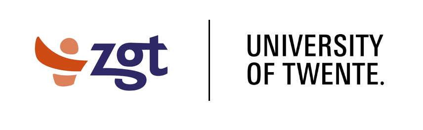

    

## Introduction
Gemicai is a machine learning library built on top of PyTorch. Gemicai makes numerous machine learning aspects more straightforward. With extensive functionality for data preprocessing, model training and evaluation, creating a tree-like structure of neural networks, automatic GPU configuration, and much more. To see what Gemicai can do, check out our Jupyter Notebook tutorials at https://gemic.ai/tutorials!

## Documentation
All of Gemicai's documentation can be found at https://gemic.ai/docs.

## Installation

Not published yet! Use development installation.
 
The distribution is hosted on pypi at: https://pypi.python.org/pypi/gemicai/. You can install the package with pip by running the following command in your terminal:

    $ pip install gemicai
    
Or with conda:

    $ conda install -c conda-forge gemicai
   
### Installing a development environment
To install a development environment for gemicai, we highly recomend using conda. First create a virtual environment for the project:

    $ conda create -n gemicai_dev
    
Activate virtual environment:
    
    $ conda activate gemicai_dev
   
Clone the repository:

    $ git clone https://github.com/Gemicai/Gemicai.git

Install gemicai in editable state:

    $ pip install -e .

You now have a development version of Gemicai installed, and local edits will be automatically included in the installed package.

## Development
Development made possible by a collaboration of ZGT (_"Ziekenhuisgroep Twente"_, translated from Dutch "Hospital Group Twente") and University of Twente. However, anyone can contribute!

**Copyright (c) 2020 Ziekhuisgroep Twente**
